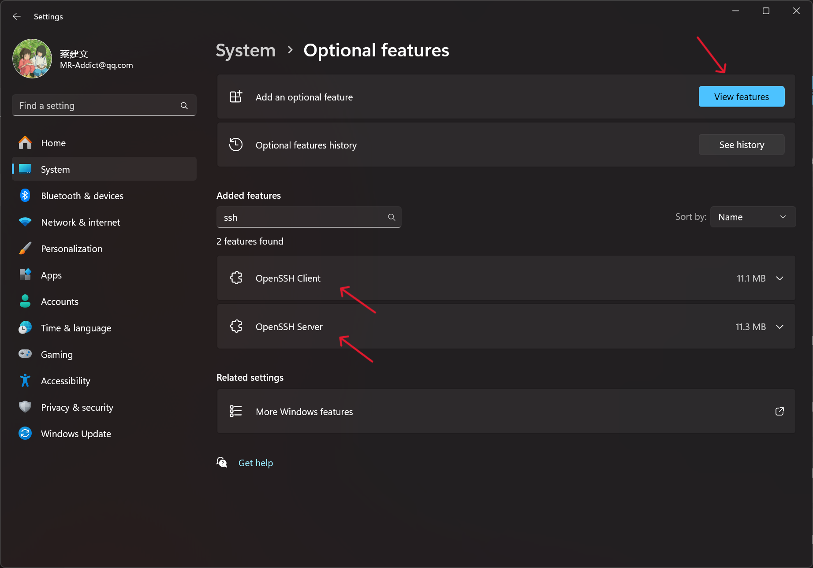

# 使用 SSH

## 一、安装 OpenSSH

如果你是 Windows 10，那么可以在 `设置` -> `应用` -> `可选功能` 中安装 OpenSSH 客户端和服务器。

如果你是 Windows 11，那么可以在 `设置` -> `系统` -> `可选功能` 中安装 OpenSSH 客户端和服务器。

请按照下图所示安装 **OpenSSH Server**，**OpenSSH Client** 可选安装，一般系统默认已经安装：



然后用管理员权限打开 PowerShell，运行以下命令查看 OpenSSH 服务状态：

```sh
Get-WindowsCapability -Online | Where-Object Name -like 'OpenSSH*'
```

输出内容类似如下：

```sh
Name  : OpenSSH.Client~~~~0.0.1.0
State : Installed

Name  : OpenSSH.Server~~~~0.0.1.0
State : Installed
```

如果 `State` 为 `Installed`，则表示 OpenSSH 服务已经安装。

## 二、配置 OpenSSH

用**管理员权限**打开 **PowerShell**。

然后设置 OpenSSH 服务自动启动：

```sh
Set-Service -Name sshd -StartupType 'Automatic'
```

接着启动 OpenSSH 服务：

```sh
Start-Service sshd
```

最后查看 OpenSSH 服务状态：

```sh
Get-Service -Name sshd
```

另外也可以查看 **22** 端口是否已经监听：

```sh
netstat -an | findstr /i ":22"
```

## 三、配置防火墙

如果你的 Windows 系统开启了防火墙，那么需要配置防火墙允许 OpenSSH 服务通过。

用管理员权限打开 **PowerShell**，查看防火墙规则：

```sh
Get-NetFirewallRule -Name *OpenSSH-Server* | select Name, Enabled
```

输出内容类似如下：

```sh
Name                  Enabled
----                  -------
OpenSSH-Server-In-TCP    True
```

如果 `Enabled` 为 `False`，则表示防火墙规则未启用，需要启用防火墙规则：

```sh
New-NetFirewallRule -Name sshd -DisplayName 'OpenSSH Server (sshd)' -Enabled True -Direction Inbound -Protocol TCP -Action Allow -LocalPort 22
```

## 四、配置文件

> 官方文档 📝
>
> [OpenSSH 官方文档](https://man.openbsd.org/sshd_config)

如果你有其他的 SSH 配置需求，可以修改 SSH 的配置文件：

```
C:\Programdata\ssh\sshd_config
```

例如，你可以修改 SSH 的端口号：

```sh
Port 2222
```

还例如，我们想使用 Powershell 作为默认的 Shell，可以修改如下配置：

```sh
ForceCommand pwsh.exe
```

修改配置文件后，需要重启 OpenSSH 服务：

```sh
Restart-Service sshd
```

## 五、使用 SSH

在 Winddows 上使用 SSH 类似于在 Linux 或 macOS 上使用 SSH，可以参考后面 [在 Linux 中使用 SSH](../linux/ssh.md) 的文档。

在 Windows 系统中，可以使用 `ssh` 命令连接远程服务器，例如：

```sh
ssh username@hostname
```

其中 `username` 是远程服务器的用户名，`hostname` 是远程服务器的 IP 地址或域名。

如果你的远程服务器使用非默认的 SSH 端口，可以使用 `-p` 参数指定端口：

```sh
ssh -p port username@hostname
```

其中 `port` 是远程服务器的 SSH 端口。

如果你的远程服务器使用密钥登录，可以使用 `-i` 参数指定密钥文件：

```sh
ssh -i keyfile username@hostname
```

其中 `keyfile` 是密钥文件的路径。
