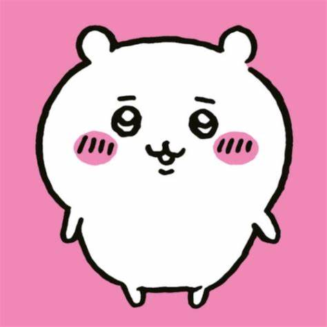
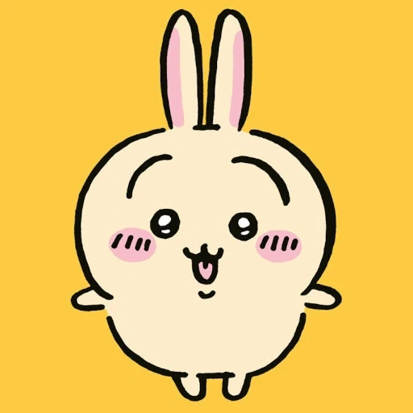
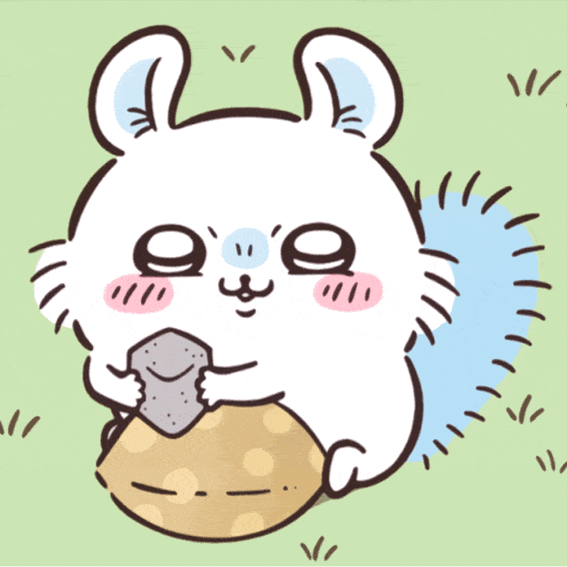
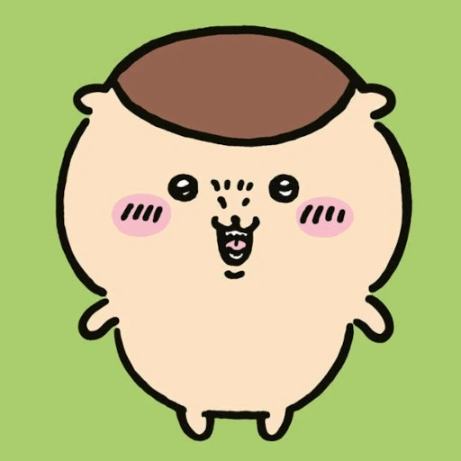
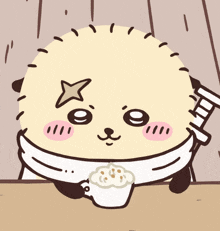

# 吉伊卡哇

> Wikipedia 📝
>
> [吉伊卡哇](https://zh.wikipedia.org/wiki/吉伊卡哇)

## 一、简介

《吉伊卡哇》（日语：ちいかわ，英语：Chiikawa）是由日本漫画家长野创作的漫画系列，副标题《这又小又可爱的家伙》。该系列自 2020 年 1 月起透过 Twitter 进行连载，并由讲谈社出版单行本。

本作主要描绘一群画风独特的小动物**小可爱的日常**的漫画展开，并以简单的多格漫画，呈现不同的故事，世界充满了森林、草原等自然丰富的景色，周围还有巨大的食物、如同植物一样自生。虚构世界住宅和商店林立，存在货币经济和互联网。

作为这个世界的居民，包括小可爱们主要从事像**除草**和**讨伐**这样的工作，以此维持生计。这些工作都是由一种叫做**盔甲先生**的种族提供的，此外，还存在着各种资格和相应的考试，根据资格的不同可以获得更高的报酬，还可以喝酒。

此外，这个世界还有一些奇妙的生物，其中一些个体可能对生物造成危害。还有一些个体能够进行对话。

这个世界的居民主要是小可爱们，以下是一些主要角色。

## 二、主角

### 吉伊卡哇 （ちいかわ）

本作的主角。

白色仓鼠外型的小可爱，是小八猫和兔兔最好的朋友，大部分时间都会在一起玩。虽然会说话但几乎没有台词，很多时候只会说**哇**、**耶**、**呼**等几句话。性格敏感懦弱、容易因害怕而哭泣。是三小只中的胆小鬼，有社交恐惧症，经常依赖小八猫帮忙传话。但往往都第一个冒着危险保护朋友免受邪恶怪物的攻击，展现出无私奉献的一面。

不喜欢吃花椰菜。拥有很强的抽奖运，目前居住的房子是在超级可口优酪乳送房抽奖活动抽中的，此外也曾在美味布丁的抽奖活动中抽到日式牛肉火锅套餐。目前正在为通过除草检定 5 级考试而奋斗。吉伊卡哇的名字是该系列完整标题**なんか小さくてかわいいやつ**的缩写，意思是**又小又可爱**。

- 别名：吉伊、小可爱
- 物种：仓鼠

### 小八猫（ハチワレ）

吉伊卡哇和兔兔的朋友。

有着独特的**蓝色**尾巴和耳朵的**奔驰猫**型小可爱。与吉伊卡哇相反，性格开朗健谈，积极向上，擅长社交。在三小只中是最成熟外向的，但偶尔有些天然呆。会对自己造成的错误加以反省并决心更加努力。小八猫对朋友相当忠诚，在有困难的时候会及时伸出援手，当吉伊卡哇感到沮丧时也会尽力安慰他。

对艺术表现出了极高的兴趣。会存钱买了一台相机来追求自己的摄影爱好。一个人住在洞窟里。没有门所以常被怪物频繁入侵攻击。拥有除草检定 5 级证照。

- 别名：小八、八字猫
- 物种：奔驰猫

### 兔兔（うさぎ）

吉伊卡哇和小八猫的朋友。

黄色兔子外型的小可爱，几乎不太说话，平时只会发出**乌拉**、**呀哈**、**哈**等等叫声。性格贪吃，爱好自由，经常情绪高涨，导致有些时候会成为麻烦制造者，是三小只中最果断的。初期喜欢欺负吉伊卡哇，但随着和吉伊卡哇、小八猫的长时间相处开始变得重视朋友，也会小可爱出现危机时给予帮助。

虽然平时疯疯癫癫，能力和警觉性却意外地很强，在营救睡衣党的三名成员时第一个从远处注意到他们遭遇大鸭追杀并前往拯救。当吉伊卡哇被怪物绑架时，被小八唤醒的兔兔立即保持警惕并做好战斗准备。拥有除草检定 3 级证照。即使面对危险，永远都维持着一样的表情。

- 别名：乌萨奇、兔子、537
- 物种：兔子

## 三、其他角色

### 小桃鼠（モモンガ）

白色飞鼠外型的小可爱。

个性聪明，非常以自我为中心，经常做出捣蛋、偷吃东西来乞求关注和赞扬的行为给其他角色制造麻烦。虽然没有正式证实，但故事中暗示了他原本是一只名叫**大强**的怪物，因为不明原因从真正的小桃那里夺得身体主导权。后来得知有游戏中心有一台能够交换灵魂的老虎机，并将它给砸烂以防万一。它的名字来源于日语单词"モモンガ"，意思是飞鼠。

- 别名：飞鼠、小桃、莫莫咖、毛毛力
- 物种：飞鼠

### 栗子馒头（栗まんじゅう）

日本栗子面包和蜜獾外型的小可爱。

经常表现得像一个中年日本男子，拥有饮酒证照。剧情中登场很多时候都是在喝酒或吃下酒零食。有时会因为喝太多宿醉脸色发青。性格豪迈大气，在除草劳动时会请吉伊卡哇喝罐装咖啡。 几乎没有台词，吃饭的时候只会发出**哈**的声音。

- 别名：栗子馒头前辈、布丁狗前辈
- 物种：蜜獾

### 海獭（ラッコ）

海獭外型的小可爱。

右眼上方有一个十字形的疤痕。他在讨伐排名顺位第一。时常执行讨伐和其他高风险任务。外表看似严肃实则很照顾后辈，喜欢甜食，只要吃到甜的东西就会开心的作出托腮动作。拥有一台专属的汽车。时常在甜点特卖会时开车前往卖场。

- 别名：海獭勇者、海獭师傅、师傅、獭师
- 物种：海獭
