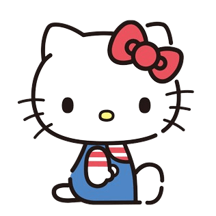
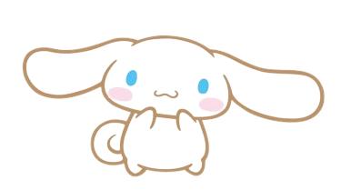
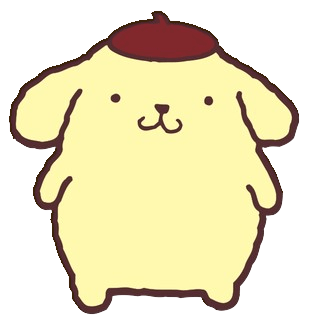
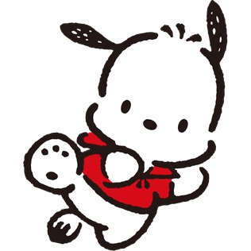

# Sanrio（三丽鸥）

## 一、简介

[Sanrio](https://en.wikipedia.org/wiki/Sanrio)（三丽鸥）是一个日本的公司，成立于 1960 年，以设计、授权和销售可爱的角色商品而闻名。Sanrio 的角色包括 **Hello Kitty**、**美乐蒂**、**库洛米**和**帕恰狗** 等，深受全球消费者的喜爱。

## 二、角色

三丽鸥旗下有很多可爱的角色，以下是一些比较知名的角色：

### Hello Kitty

> Wikipedia 📝
>
> [Hello Kitty](https://zh.wikipedia.org/wiki/Hello_Kitty)

- 名称：Hello Kitty，凯蒂猫、无口猫
- 物种：猫/人（2015 年，三丽鸥发表新设定，指出：Hello Kitty 并不是猫。她走路是用两只脚，从来没有四只脚走路，并没有猫的行为特性，与过往设定并不相同。）
- 性别：女
- 最喜欢的运动：网球
- 最喜欢食物：妈妈做的苹果派、装饰著饼干颗粒的蜂蜜香草冰淇淋、镇上的面包店叔叔做的法国面包

### 美乐蒂

> Wikipedia 📝
>
> [My Melody](https://zh.wikipedia.org/wiki/My_Melody)

美乐蒂（英语：My Melody）是三丽鸥一只戴着粉色头巾（有时美乐蒂的头巾是红色）的兔子造型女性卡通形象也是第一只以兔子为造型的卡通人物，美乐蒂通常有戴蝴蝶结或白花当头饰（有时没戴），在 1975 年 1 月 18 日诞生。

- 名称：Little Red Riding Hood、My Melody、美乐蒂
- 物种：兔子
- 性别：女
- 最喜欢食物：杏仁蛋糕
- 最珍藏的物件：祖母亲手为她缝制的小红帽

### 酷洛米

> Wikipedia 📝
>
> [酷洛米](https://zh.wikipedia.org/wiki/酷洛米)

酷洛米（英语：Kuromi），港译可罗米，是三丽鸥一只戴着黑色恶魔头巾（酷洛米的头巾有时是紫色）兔子造型的女性卡通形象，酷洛米的头巾有个粉色骷髅，头巾上的骷髅会随酷洛米的心情变换表情，酷洛米的尾巴亦是恶魔形状。

- 名称：Kuromi、酷洛米
- 物种：兔子
- 性别：女
- 最喜欢的颜色：黑色
- 最喜欢食物：腌蕗荞（小蒜！）

### 玉桂狗

> Wikipedia 📝
>
> [玉桂狗](https://zh.wikipedia.org/wiki/玉桂狗)

大耳狗（英语：Cinnamoroll），又名玉桂狗、喜拿、肉桂狗，是三丽鸥一只蓝眼白肤色的狗造型男性卡通形象。
从遥远天空的白云上出生的男性白色小狗。因为有着像肉桂卷一般卷卷的尾巴，所以被取名为“大耳狗喜拿”。

有一天，大耳狗喜拿碰巧在 Café Cinnamon 咖啡厅被工作的大姐姐发现，从此开始住在一起生活。现在是店里的狗。特技是用大大的耳朵在空中飞翔。他的个性很乖巧，非常喜欢与人相处，有时甚至会趴在客人的膝盖上睡觉。

- 名称：Cinnamoroll、玉桂狗、肉桂狗
- 物种：狗
- 性别：男
- 专长：用大耳朵飞翔
- 最喜欢食物：Café Cinnamon 的肉桂卷

### 布丁狗

> Wikipedia 📝
>
> [布丁狗](https://zh.wikipedia.org/wiki/布丁狗)

布丁狗（Pom Pom Purin），又名布甸狗，是三丽鸥一只戴着棕色贝雷帽的黄金猎犬造型男性卡通形象。

关于茶色帽子的故事： 有一天，我的小主人放了一顶小帽帽在我的头上，然后大家都说：“哇！好像好好吃的布丁喔！”，从此以后，大家就叫我“布丁狗”，其实我也很喜欢这顶帽子呢！

- 名称：Pom Pom Purin、布丁狗
- 物种：黄金猎犬（黄金寻回犬，Golden Retriever）
- 性别：男
- 最爱听的话：出门啰！
- 最喜欢的食物：牛奶、妈妈做的布丁

### 帕恰狗

> Wikipedia 📝
>
> [帕恰狗](https://zh.wikipedia.org/wiki/帕恰狗)

帕恰狗（英语：Pochacco），香港叫 PC 狗/PC Dog，是三丽鸥一只白皮肤黑耳朵的狗造型的男性卡通形象。

- 名称：Pochacco、帕恰狗
- 物种：狗
- 性别：男
