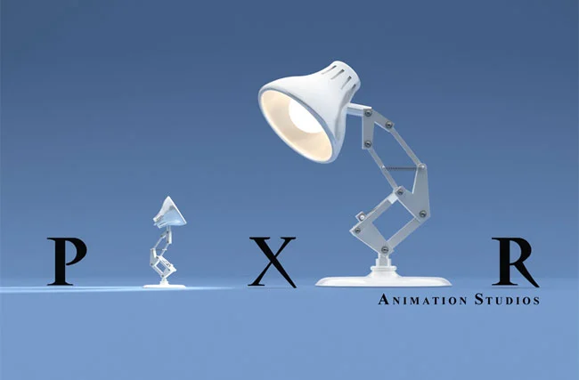

# 皮克斯动画工作室

## 一、简介

皮克斯动画工作室（Pixar Animation Studios），简称皮克斯（英语：Pixar），其总部位于美国加利福尼亚州的埃默里维尔，是一家以**计算机动画制作**而闻名的动画电影制片公司。

1986 年，**乔布斯**收购了卢卡斯影业的计算机动画部。2006 年，皮克斯被**华特迪士尼公司**以 74 亿美元收购，成为迪士尼的一部分，乔布斯亦因此成为迪士尼在 2006 年至 2011 年的最大个人股东，直到 2011 年乔布斯逝世后股权才完全归入迪士尼。

截至 2022 年，皮克斯一共发布了 26 部动画长片，第一部是 1995 年的《玩具总动员》，最近的一部是 2024 年的《头脑特工队 2》。皮克斯的 23 部作品都获得了 [CinemaScore](https://zh.wikipedia.org/wiki/影院评分) 至少“A-”的评价，表示得到了观众的积极接受。截至 2019 年 7 月，该公司的所有作品在全世界累计获得了 140 亿美元的票房，平均每部电影获得 6.8 亿美元。有 15 部皮克斯电影曾进入电影票房收入前五十名，其中《玩具总动员 3》成为了全球首部超过十亿美元票房的动画电影。

## 二、作品

> Wikipedia 📝
>
> [皮克斯动画电影列表](https://zh.wikipedia.org/wiki/皮克斯电影列表)

| 电影名称                           | 上映年份 | 票房收入（亿美元） |
| :--------------------------------- | :------- | :----------------- |
| Toy Story   玩具总动员         | 1995     | 3.61               |
| A Bug's Life   虫虫危机        | 1998     | 3.63               |
| Toy Story 2   玩具总动员 2     | 1999     | 4.97               |
| Monsters, Inc.   怪兽电力公司  | 2001     | 5.25               |
| Finding Nemo   海底总动员      | 2003     | 9.36               |
| The Incredibles   超人总动员   | 2004     | 6.31               |
| Cars   汽车总动员              | 2006     | 4.61               |
| Ratatouille   料理鼠王         | 2007     | 6.23               |
| WALL-E   机器人总动员          | 2008     | 5.21               |
| Up   飞屋环游记                | 2009     | 7.31               |
| Toy Story 3   玩具总动员 3     | 2010     | **10.66**          |
| Cars 2   汽车总动员 2          | 2011     | 5.62               |
| Brave   勇敢传说               | 2012     | 5.40               |
| Monsters University   怪兽大学 | 2013     | 7.44               |
| Inside Out   头脑特工队        | 2015     | 8.57               |
| The Good Dinosaur   恐龙当家   | 2015     | 3.32               |
| Finding Dory   海底总动员 2    | 2016     | **10.28**          |
| Cars 3   汽车总动员 3          | 2017     | 3.83               |
| Coco   寻梦环游记              | 2017     | 8.07               |
| Incredibles 2   超人总动员 2   | 2018     | **12.42**          |
| Toy Story 4   玩具总动员 4     | 2019     | **10.73**          |
| Onward   头脑特工队 2          | 2020     | 1.41               |
| Soul   心灵奇旅                | 2020     | 1.13               |
| Luca   夏日友晴天              | 2021     | 2.79               |
| Turning Red   青春变形记       | 2022     | 0.19               |
| Lightyear   光年正传           | 2022     | 2.14               |
| Elemental   疯狂元素城         | 2023     | 4.80               |
| Inside Out 2   头脑特工队 2    | 2024     | **16.98**          |
