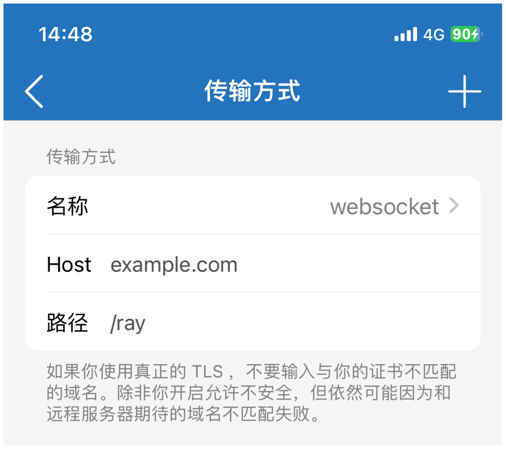

# 使用 V2ray

```admonish info
参考教程[v2ray](https://www.linuxbabe.com/ubuntu/set-up-v2ray-proxy-server)
```

## 一、在服务器上安装 V2ray

先安装依赖：

```sh
sudo apt install curl unzip
```

下载安装脚本：

```sh
curl -O https://raw.githubusercontent.com/v2fly/fhs-install-v2ray/master/install-release.sh
```

安装 V2ray：

```sh
sudo bash install-release.sh
```

开启自启动 V2ray：

```sh
sudo systemctl enable v2ray
```

启动 V2ray：

```sh
sudo systemctl restart v2ray
```

查看 V2ray 状态：

```sh
sudo systemctl status v2ray
```

## 二、配置 V2ray

检查时间是否校准，和 UTC 时间要小于 60s：

```sh
timedatectl
```

配置 V2ray 配置文件，请设置一个安全的`id`，这相当于一个密码，你可以使用这个[地址](https://www.uuidgenerator.net)生成一个 UUID：

```sh
sudo vim /usr/local/etc/v2ray/config.json
```

添加以下内容：

```json
{
  "log": {
    "loglevel": "warning",
    "access": "/var/log/v2ray/access.log",
    "error": "/var/log/v2ray/error.log"
  },
  "inbounds": [
    {
      "port": 1000,
      "listen": "0.0.0.0",
      "protocol": "vmess",
      "settings": {
        "clients": [
          {
            "id": "ac2f5a2a-08e8-11ee-be56-0242ac120002",
            "alterId": 0
          }
        ]
      },
      "streamSettings": {
        "network": "ws",
        "wsSettings": {
          "path": "/ray"
        }
      }
    }
  ],
  "outbounds": [
    {
      "protocol": "freedom",
      "settings": {}
    }
  ]
}
```

重启 V2ray 让配置生效：

```sh
sudo systemctl restart v2ray
```

查看 V2ray 监听端口：

```sh
sudo ss -lnpt | grep v2ray
```

## 三、配置 Nginx 反向代理

安装 Nginx：

```sh
sudo apt install nginx -y
```

添加 V2ray 配置：

```sh
sudo vim /etc/nginx/conf.d/v2ray.conf
```

添加以下配置：

```
server {
  listen 80;
  server_name  your_domain;

  index index.html;
  root /usr/share/nginx/html/;

  error_log /var/log/nginx/v2ray.error;
  access_log /var/log/nginx/v2ray.access;

  location /ray {
    proxy_redirect off;
    proxy_pass http://127.0.0.1:10000;
    proxy_http_version 1.1;
    proxy_set_header Upgrade $http_upgrade;
    proxy_set_header Connection "upgrade";
    proxy_set_header Host $host;
    proxy_set_header X-Real-IP $remote_addr;
    proxy_set_header X-Forwarded-For $proxy_add_x_forwarded_for;
  }
}
```

检查配置文件：

```sh
sudo nginx -t
```

重新加载 Nginx：

```sh
sudo systemctl reload nginx
```

至此 V2ray 服务端已经配置完成。

## 四、禁用 VMESS-AEAD

为了兼容 IOS，我们需要禁用 v2ray 的 VMESS-AEAD 功能：

```sh
sudo vim /etc/systemd/system/v2ray.service
```

添加以下环境变量到 Service：

```
Environment=V2RAY_VMESS_AEAD_FORCED=false
```

## 五、配置客户端

**Clash**

```admonish info
参考教程[clash](https://v2xtls.org/深入理解clash配置文件)
```

如果你是使用 Clash，可以参考以下配置文件：

```yaml
mixed-port: 7890
mode: Global
allow-lan: true
ipv6: true
log-level: info

proxies:
  - name: your_v2ray_name
    server: your_server_address
    port: 443
    type: vmess
    uuid: ac2f5a2a-08e8-11ee-be56-0242ac120002
    network: ws
    ws-opts:
      path: /ray
    alterId: 0
    cipher: auto
    tls: true
```

**Shadowrocket**

```admonish info
参考教程[shadowrocket](https://v2xtls.org/shadowrocket配置v2ray教程)
```

请参考以下配置：


其中选择 websocket 传输方式：


